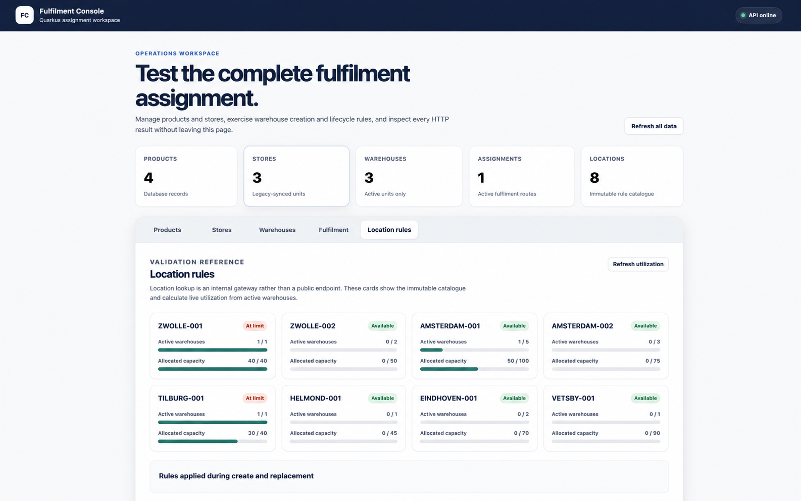
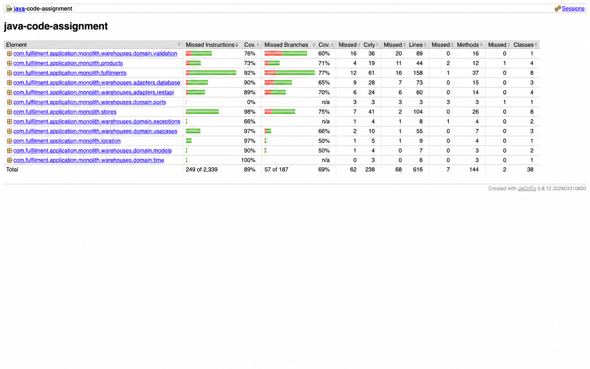
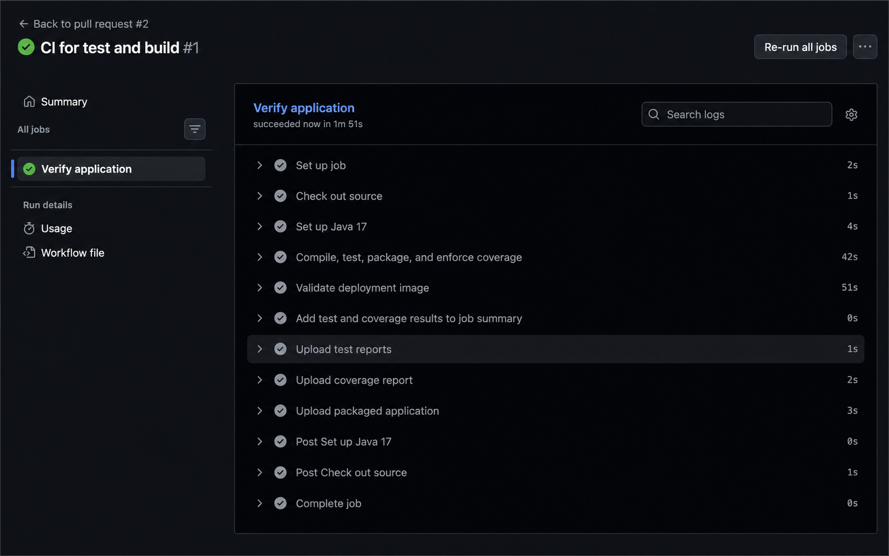

# Java Code Assignment

[](https://github.com/sdivyendh/tarento-assignment/actions/workflows/ci.yml)

This Quarkus application implements the product, store, warehouse, and fulfilment-assignment
workflows described in [CODE_ASSIGNMENT.md](CODE_ASSIGNMENT.md).

## Requirements

- JDK 17 or newer
- Docker Desktop for development mode, or an independently running PostgreSQL database

The Maven wrapper is included, so a separate Maven installation is not required.

Confirm the required tools are available:

```sh
java -version
docker info
```

## Project directory

The contents of `java-assignment` are the repository root. After cloning the GitHub repository,
enter the cloned directory:

```sh
git clone https://github.com/sdivyendh/tarento-assignment.git
cd tarento-assignment
```

Run all commands from this directory. It directly contains `pom.xml`, `mvnw`, `Dockerfile`,
`render.yaml`, and `src`; there is no nested `java-assignment` directory in GitHub.

## Run in development mode

Start Docker Desktop, then run:

```sh
./mvnw quarkus:dev
```

Quarkus Dev Services automatically starts PostgreSQL in Docker. Development mode recreates the
schema, loads the demo records from `src/main/resources/import.sql`, and enables live reload.

Open the application at:

<http://localhost:8080/index.html>

The REST API uses the same base URL:

```text
http://localhost:8080
```

Stop the application with `Ctrl+C`.

## Run from IntelliJ IDEA

1. Open the cloned `tarento-assignment` repository, or import its `pom.xml` as a Maven project.
2. Set the Project SDK and Maven runner JDK to version 17 or newer.
3. Start Docker Desktop.
4. Open the Maven tool window and run `Plugins` → `quarkus` → `quarkus:dev`.

Alternatively, create a Maven run configuration with:

```text
Command line: quarkus:dev
Working directory: <repository>/tarento-assignment
```

The application is ready when the console reports:

```text
Listening on: http://localhost:8080
Profile dev activated
```

## Build

Create the JVM application package:

```sh
./mvnw clean package
```

The runnable application is generated under `target/quarkus-app`.

## Run the tests

```sh
./mvnw clean test
```

The test profile uses an in-memory H2 database in PostgreSQL compatibility mode. Unit, persistence,
transaction, schema-migration, and REST tests therefore do not require Docker.

Quarkus REST tests normally use port `8081`. This is a temporary test port; the development and
packaged applications run on port `8080`.

## Test coverage

Run the complete verification build to execute the tests, generate the JaCoCo report, and enforce
the project-wide minimum of 80% line coverage:

```sh
./mvnw clean verify
```

The build fails during the `verify` phase if line coverage is below 80%. Open the local HTML report
at:

```text
target/jacoco-report/index.html
```

Machine-readable reports are also generated at `target/jacoco-report/jacoco.xml` and
`target/jacoco-report/jacoco.csv`. Generated OpenAPI classes under `com.warehouse.api` are excluded
because they are not maintained application source.

The GitHub Actions workflow `.github/workflows/ci.yml` runs the verification build for pull
requests, pushes to `main`, and manual workflow runs. It also validates the production Docker image,
adds test and coverage metrics to the workflow summary, and retains these downloadable artifacts
for 30 days:

- `test-results`: Maven Surefire text and XML test reports
- `jacoco-coverage-report`: complete HTML, XML, and CSV coverage reports
- `quarkus-application`: packaged JVM application from a successful build

## Run the packaged application

The packaged application uses the production profile and expects PostgreSQL at
`localhost:15432/quarkus_test`.

Start PostgreSQL:

```sh
docker run --rm \
  --name quarkus_test \
  -e POSTGRES_USER=quarkus_test \
  -e POSTGRES_PASSWORD=quarkus_test \
  -e POSTGRES_DB=quarkus_test \
  -p 15432:5432 \
  postgres:13.3
```

In another terminal, build and start the application:

```sh
./mvnw clean package
java -jar target/quarkus-app/quarkus-run.jar
```

Production datasource settings are in `src/main/resources/application.properties`. They can be
overridden with `DB_USERNAME`, `DB_PASSWORD`, and `JDBC_DATABASE_URL`. On startup, Flyway applies
the migrations in `src/main/resources/db/migration`. Migration V3 inserts the demonstration
products, stores, and warehouses once. Production startup does not repeatedly load or replace data
using `import.sql`.

## Deploy to Render

The repository includes:

- `Dockerfile`, which builds and runs the Quarkus JVM application
- `.dockerignore`, which keeps local build and IDE files out of the Docker context
- `render.yaml`, which configures a free Render web service in Singapore and connects it to the
  existing PostgreSQL database through its internal hostname

Before deploying, rotate the PostgreSQL password in Render because a previously shared password
must be treated as exposed. Do not add the replacement password to Git.

Deploy with a Render Blueprint:

1. Push this repository and the deployment files to GitHub.
2. In Render, select **New** → **Blueprint**.
3. Connect the GitHub repository and select the `render.yaml` Blueprint.
4. When Render prompts for `DB_PASSWORD`, enter the newly rotated database password.
5. Apply the Blueprint and wait for the health check at `/index.html` to pass.

The committed Blueprint contains the non-secret internal JDBC URL and database username. Render
injects the password at runtime because `DB_PASSWORD` is declared with `sync: false`. The web
service and database must remain in the Singapore region for the internal database hostname to be
reachable.

## Available UI and APIs

The browser console contains five tabs:

- Products
- Stores
- Warehouses
- Fulfilment
- Location rules

The main API paths are:

| Feature | API path |
| --- | --- |
| Products | `/product` |
| Stores | `/store` |
| Warehouses | `/warehouse` |
| Fulfilment assignments | `/fulfilment-assignments` |

Location resolution and legacy-store synchronization are internal application operations and do not
have separate HTTP endpoints.

The Fulfilment API supports creating, listing, filtering, and deleting Store–Product–Warehouse
assignments. It enforces these rules:

- A Product can use at most 2 different Warehouses per Store.
- A Store can use at most 3 different Warehouses.
- A Warehouse can store at most 5 different Product types.

Assignments are also kept consistent with lifecycle operations: product/store deletion removes
related assignments, warehouse replacement transfers them, and warehouse archive removes them.

## Project screenshots

### Fulfilment Console

The Location Rules tab displays the configured locations together with their warehouse and capacity
utilization.



### Test coverage

The JaCoCo HTML report provides package-level instruction, branch, line, method, and class coverage.



### Continuous integration

GitHub Actions verifies the application, enforces the coverage threshold, validates the Docker
image, and publishes the test, coverage, and packaged-application artifacts.



## Postman collection

Import:

```text
postman/Fulfilment-API.postman_collection.json
```

Start the application on port `8080` before running it. The collection variable `baseUrl` already
defaults to `http://localhost:8080`.

The collection contains ordered workflows for Products, Stores, Warehouses, and Fulfilment
Assignments. The Fulfilment folder covers:

- Assignment creation, listing, filtering, and deletion
- Duplicate-assignment conflict handling
- Assignment transfer during warehouse replacement
- Assignment cleanup during warehouse archive

## Troubleshooting

### The old UI is displayed

- Confirm the running configuration uses the cloned repository root containing `pom.xml`.
- Stop any other process using port `8080`.
- Restart `./mvnw quarkus:dev`.
- Perform a hard browser refresh (`Cmd+Shift+R` on macOS or `Ctrl+Shift+R` on Windows/Linux).

### Port 8080 is already in use

On macOS or Linux, find the listening process with:

```sh
lsof -nP -iTCP:8080 -sTCP:LISTEN
```

Stop the old application before starting a new one.

### IntelliJ cannot resolve generated API classes

Reload the Maven project. If required, mark the generated `target/.../jaxrs` directory as
**Generated Sources Root**.

### Docker or PostgreSQL startup fails

Confirm Docker Desktop is running:

```sh
docker info
```

Then restart development mode. Tests can still be run without Docker because they use H2.
